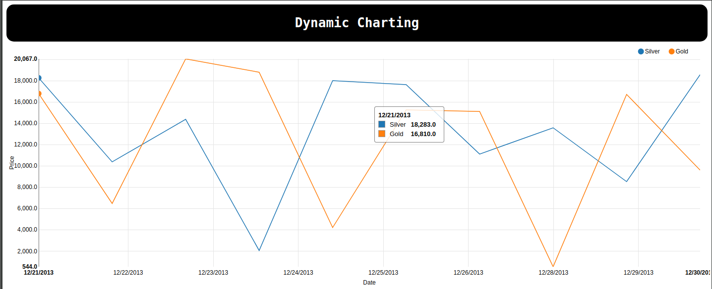

# Description

A simple dynamic charting project to fetch specific assets on Backend and render
graphics with d3 on Frontend. Using Giraffe on Backend and Fable on Frontend. Full F#
web application.

## Architecture



The project was develop to save the assets on server using Giraffe and provide
the assets on the GET routes /silver and /gold. Before initialize the Giraffe server, a
synchronous request is done to save locally SILVER.json and GOLD.json on `/tmp` folder.
After that, two asynchronous task are initiated to download each file after 1 minute.
So then the server giraffe is enable. This ensure that when /silver and /gold will
be called at least one version of SILVER.json and GOLD.json exists on the server.

The frontend was designed to use Fable for transpiling F# |> JS and
charting the graphics using Line Chart by binding the libs of d3.js and nvd3.js.
Partially, some binds I got from an external repository: [FableCharting](https://github.com/hoonzis/FabledCharting)

## Requirements

* [dotnet SDK](https://www.microsoft.com/net/download/core) 1.0.4 and runtime
* [node](https://nodejs.org/en/download/)
* [yarn](https://yarnpkg.com)
* [Giraffe](https://github.com/dustinmoris/Giraffe)
* [Fable](https://github.com/fable-compiler/Fable)
* [Mono](http://www.mono-project.com/download/) (for build: `msbuild`)

## Build

You need fetch the `nodejs` dependencies with `yarn install` on the root of the
repository. So then build the Frontend and Backend, in that order. For building
Frontend and Backend a shell script util is provided: `build.sh`.

The overall steps is:

``` shell
yarn install
./build.sh
```

The build.sh will call `dotnet restore && dotnet fable yarn-run build` on the root
of Frontend. This will generate a /public/bundle.js file as target.
So then, will be called on src/Backend: `dotnet clean; dotnet restore; msbuild; dotnet run`.
This should generate the binaries, copy the `public` folder as `WebRoot` and provide
as static files.

The build binaries should be generated on `src/Backend/bin/Debug/netcoreapp1.1/`
directory.

## License
Unlicensed

## Author
Manoel Vilela
